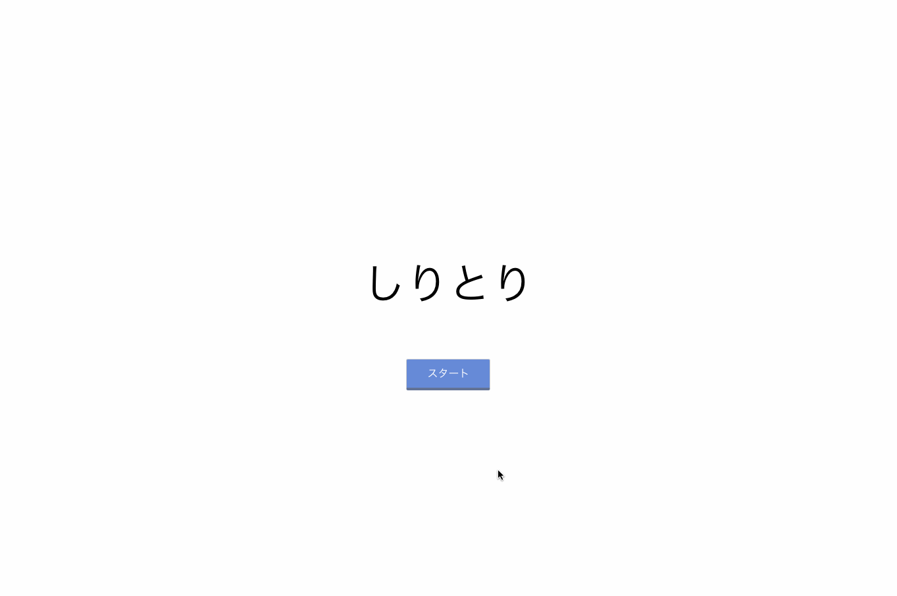

# Chain-Game



### Description

This app is Shiritori judge application. Shiritori is a word game in Japan.<br/>
This app uses `GoogleSpeechToText API`. Also, word judgement is delefated to `kuromoji.js`.

### Requirements

This app is requires the following to run:

- node.js
- npm

### Usage

```
npm start
```

Run the app in the development mode.<br>
Open [http://localhost:3000](http://localhost:3000) to view it in the browser.
